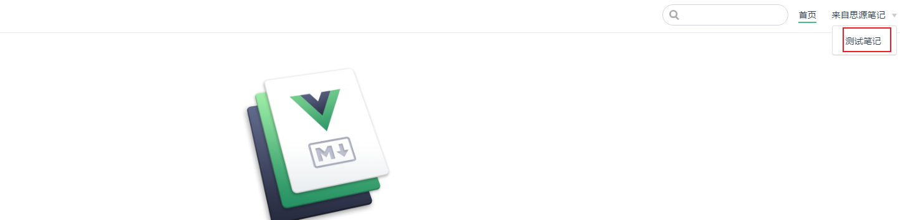

# README

## 概述

该项目是基于 [vuepress](https://vuepress.vuejs.org/zh/) 和 [思源笔记](https://b3log.org/siyuan/) 的博客系统。经过适配，实现了思源笔记和 VuePress 的工作流打通，使得思源笔记导出的内容可以直接用于 VuePress 的博客系统，无需关注更多的 VuePress 概念。同时，该系统仍支持基于 VuePress 的操作，例如添加插件等，不会影响 VuePress 本身的更多拓展。

## 依赖

1. **Node.js 版本**

   需要 Node.js 版本为 18.9 及以上，推荐直接安装 18.19.0。
2. **Python 版本**

   理论上任何 Python 3 版本皆可，但后续处理时会将 `setuptools` 的版本降级。如果介意，建议使用虚拟环境。

## 约定

### .env 配置文件

项目根目录下有一个 `.env.tpl` 文件，使用时应将其重命名为 `.env` 或复制一份。其中包含一些处理脚本会用到的配置项，具体解释如下：

```python
IMAGE_URL="https://assets.b3logfile.com/siyuan/xxxxxx/"
DOCS_VAL="来自思源笔记"
SITE_TITLE="思源笔记"
SITE_DESC="来自思源笔记的内容"
```

#### `IMAGE_URL`

`IMAGE_URL`是用户自己的思源笔记图床链接前缀，我们在思源笔记中点击了【上传资源文件到图床】之后，假设文件中有使用到图片 `/assets/image-20231223225013-rxopw4v.png`之后我们就可以直接用 `https://assets.b3logfile.com/siyuan/xxxxxx/assets/image-20231223225013-rxopw4v.png`来访问。

> 或者有类似的直接添加前缀的图床链接也可以直接设置在这。
> 目前图床仅适配思源笔记的官方图床。如果有其它图床的需求，可提 issue。

以下仅限思源笔记付费订阅用户可用。

思源笔记图床链接获取方式：

1. 找一篇笔记，粘贴一张图片
2. 点击右上角【更多】-【上传资源文件到图床】
3. 点击【设置】-【云端】-【云端存储】-【图床】，会进入b3log的网页后台，可以看到自己上传的图片

   
4. 随便选择一张图片，鼠标放到上面，点击【URL】，会跳到一个新的标签页
5. 选择一张图片，点击【URL】，在新标签页的 URL 中找到图床链接，配置到 .env 文件的 IMAGE_URL 中

   

```python

# TO

```

‍

#### `DOCS_VAL`

`DOCS_VAL` 是自动生成的导航栏 `title`，可以修改此值进行控制。


‍

#### `SITE_TITLE`

站点名称，如果设置会直接覆盖。


‍

#### `SITE_DESC`

站点描述，如果设置则会直接覆盖。用于 HTML 头部的 meta 信息中。

‍

### 文件夹内容和README内容二选一

以下是文件结构示例：

```sh
docs/测试笔记/
├── README.md
├── 一层笔记1
│   ├── README.md
│   ├── 二层笔记1.1.md
│   └── 二层笔记1.2.md
├── 一层笔记2
│   ├── README.md
│   └── 二层笔记2.1
│       ├── README.md
│       └── 三层笔记2.1.1.md
└── 一层笔记3.md
```

在 VuePress 中，如果在 docs 目录下请求的链接是一个文件夹，将展示该文件夹下的 README.md 文件内容。如果不存在，则会显示 404。

例如在上面的例子中我们请求 `http://localhost:8080/测试笔记/一层笔记/`实际展示的就是 `http://localhost:8080/测试笔记/一层笔记/README.md`中的内容。

因此，在处理 一层笔记 时，将其内容覆写到其下的 README.md 文件中，以确保 VuePress 和思源笔记的展示逻辑统一。

但如果在思源笔记中的节点下存在名为 README 的子节点，导出笔记后文件夹下会有一个自动生成的 README.md 文件。在进行覆写操作时会检查文件夹下是否存在 README.md 文件，如果有则会跳过。

> 优先级：原本笔记中的 README.md 文件大于文件夹节点的内容。

总的来说就是建议文件夹节点写内容和README子节点写内容二选一。

‍

## 使用

0. 克隆项目并安装依赖

   ```sh
   git clone xxx
   cd xxx
   yarn install
   # 如果没有yarn命令可尝试安装
   # npm install -g yarn
   ```

1. 将项目根目录下的 .env.tpl 文件复制一份并命名为 .env，根据约定修改其中内容：

   ```python
   cp .env.tpl .env
   # 如果没有cp命令建议手动执行
   ```
2. 从思源笔记选择一篇笔记，点击更多 -> 导出 -> Markdown：

   
3. 将下载的压缩包放到项目根目录下（或其他位置，但需要记住位置）：

   
4. 执行转换命令

   ```python
   make load f=测试笔记.md.zip
   # 如果没有make命令可尝试安装 或 直接执行python命令
   # python process_siyuan_export.py load -f 测试笔记.md.zip
   # # 这里的 测试笔记.md.zip 可以根据压缩包的实际位置自行更改
   ```
5. 执行启动命令

   ```sh
   make dev
   # 如果没有make命令可尝试安装 或 直接执行yarn命令
   # yarn dev
   ```
6. 打开浏览器访问 http://localhost:8080/ ，即可看到思源笔记中的内容已经在 VuePress 中展示出来了。

   

   
7. 获取构建后的静态文件

   ```sh
   make build
   # 如果没有make命令可尝试安装 或 直接执行yarn命令
   # yarn build
   ```
8. 将构建后的静态文件部署到服务器上即可。
   > 生成的静态文件在docs/.vuepress/dist目录下

‍

## 其他

### 自定义logo

如果需要自定义 logo，放一个logo.png 文件在 docs/.vuepress/public 目录下即可。

## 最后

项目属于个人维护，所有功能都是基于个人需求开发，如果有其它需求，欢迎提 issue 或 PR。
